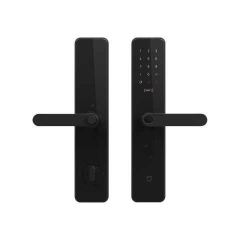
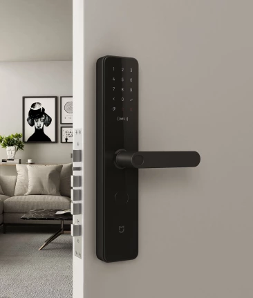
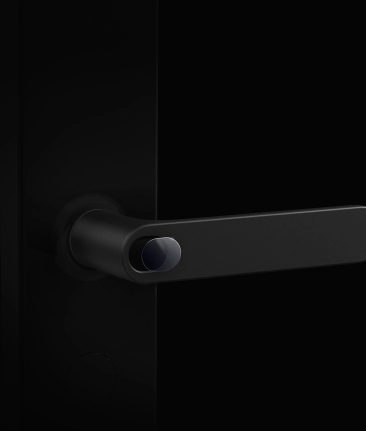

# Умный замок Xiaomi Mijia Smart Door Lock \(Carbon Black\)

Замок интегрируется в систему умного дома, подключается через приложение Mi Home. Поддерживает до 6 способов разблокировки - по отпечатку пальца, по паролю, через NFC, Bluetooth и другие.

Сканер Mijia Smart Door Lock имеет утопленную округлую платформу для распознавания отпечатков. Платформа изготовлена из износоустойчивых материалов, благодаря чему сканер будет срабатывать так же быстро и точно даже спустя долгое время. А благодаря биометрическому алгоритму распознавания живого тела злоумышленники не смогут открыть замок с помощью поддельных отпечатков, и следовательно не смогут попасть в Ваш дом.

Так же стало возможно создание длинных паролей для входа - до 20 цифр пин-кода, создание одноразовых паролей, и создание паролей с ограниченным сроком действия.

Дополнительно замок можно открыть с помощью смартфона с поддержкой NFC, по Bluetooth, либо через приложение Mi Home. На случай отключения электричества предусмотрен аварийный ключ. 

| Характеристики Mijia Smart Door Lock |  |
| :--- | :--- |
| CMIIT ID | 2018DP6075 |
| Доступные цвета | Черный |
| Размеры | 365.6 х 75.6 х 24.5 мм |
| Вес | 5.1 кг |
| Параметры входа | Micro USB \(5V\): 8 батареек AA |
| Версия Bluetooth | 5.0 |
| Прошивка | Поддержка китайского и английского языков |
| Количество сохраненных паролей | 50 отпечатков, 50 пин-кодов, 25 NFC-устройств |
| Толщина двери для крепления | 40-80 мм; возможно увеличить до 80-120 мм |
| Уровень влажности | 0-93% RH \(без конденсации\) |
| Диапазон температур | -25 ~ +55 С |
| Официальный сайт | [https://www.xiaomiyoupin.com/detail?gid=105377](https://www.xiaomiyoupin.com/detail?gid=105377) |

