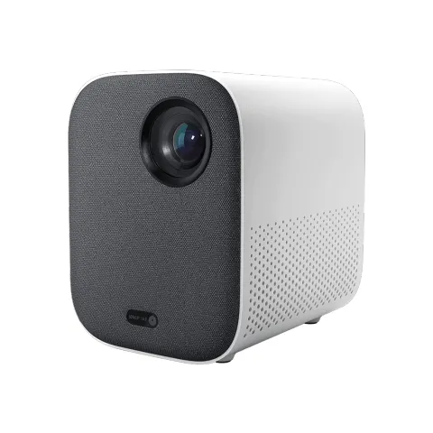

# Mijia Projector Youth Version

Кодовый номер устройства - MJJGTYDS02FM



|  |  |
| :--- | :--- |
| Тип | DLP \(DLP-LINK 3D\) |
| Размеры | 115 х 150 х 150 мм |
| Вес | 1.3 кг |
| Световой поток | 500 ANSI |
| Отображение информации | 0.33" DMD |
| Разрешение | FullHD \(1920 x 1080 p\) |
| 3D | Поддерживается |
| HDR | Поддерживается HDR10 |
| Отношение расстояния к размеру изображения | 1.2:1 |
| Процессор | Amlogic T968-H |
| Операционная система | MIUI TV \(Patchwall, AI Voice Control\) |
| Wi-Fi | Поддерживается, 2.4 и 5G |
| Аудио | Dolby Audio, DTS-HD |
| Разъемы | Audio, USB 3.0, HDMI |
| Заявленный срок эксплуатации | 30000 часов |
| Ссылка на официальный сайт | [https://youpin.mi.com/detail?gid=105302](https://youpin.mi.com/detail?gid=105302) |



