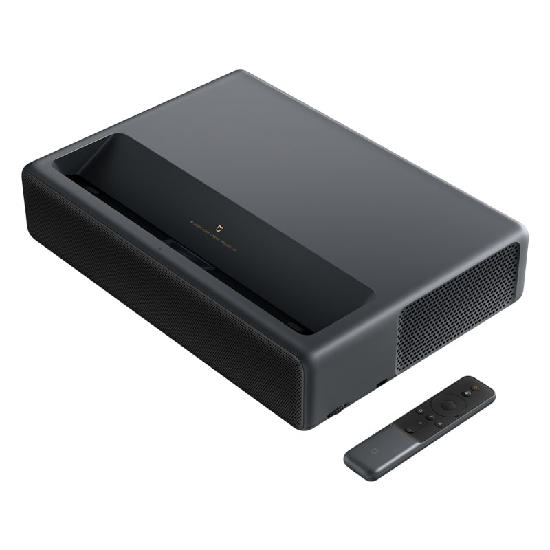

# Mijia TV 4K Laser Projection

Модель - кодовое название устройства MJJGTYDS01FM.



|  |  |
| :--- | :--- |
| Тип | ALDP 3.0 |
| Размеры | 410 х 291 х 88 мм |
| Вес | 7.2 кг |
| Световой поток | 1500 ANSI |
| Отображение информации | 0.47" DMD  |
| Разрешение | 4K \(3840 х 2160\) |
| HDR | Поддерживается |
| Контрастность | 3000:1 |
| Отношение расстояния к размеру изображения | 0.233:1 |
| Процессор | Т968-Н |
| Видеопроцессор |  |
| ОЗУ | 2 Gb DDR3 |
| ПЗУ | 16 Gb eMMC |
| Параметры входа | 200-240V, 50/60 Hz |
| Операционная система | MIUI TV \(Patchwall, AI Voice Control\) |
| Аудио | Dolby Audio, DTS-HD |
| Комплектация | Проектор, пульт, 2 батарейки, кабель для подключения, инструкция, гарантийный талон |
| Разъемы | 3x HDMI \(включая ARC\), USB 3.0, Audio Output, AV Input, S/PDIF, LAN  |
| Заявленный срок эксплуатации | более 25000 ч |
| Ссылка на официальный сайт | [https://item.mi.com/1190200023.html](https://item.mi.com/1190200023.html) |







